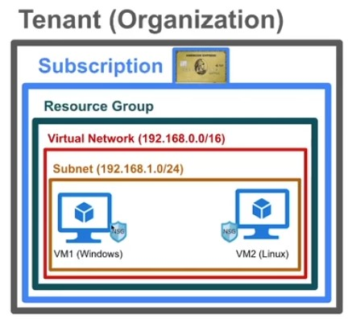
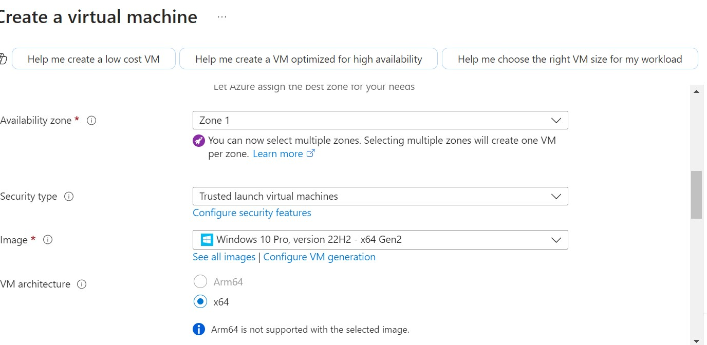
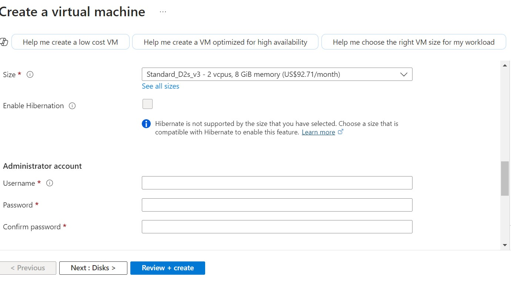
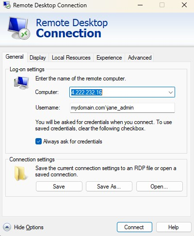

# Creating-a-VM

<h1>Creating a virtual machine through Azure</h1>
<h2>Description</h2>
This repositiory provides a step-by-step guide on how to create a Virtual Machine (VM) in a cloud environment (Azure). It covers key concepts such as:  
-subsciption and resoursce Groups 
-virtual networks  
-creating and Configuring a VM

<h2>Environments and Technologies Used</h2>

- Microsoft Azure Virtual Machines (Compute)
- Remote Desktop (RDP) To access the VM
- Active Directory Domain Services (AD DS) For authentication athentication and managment

<h2>Operating Systems Used </h2>

- Windows 10 Pro Version (22H2)-x64 Gen2

<h2>High-Level Deployment and Configuration Steps</h2>

- <h3>Step 1</h3>
Create a Vm in Azure (via portal or Cli).
- <h3>Step 2</h3>
Configeur networking firewall rules and access.
- <h3>Step 3</h3>
Appleid security best practices and enabled monitoring. 
- <h3>Srep 4</h3>
review and create.
- <h3>Srep 5</h3> 
Open your VM through remote desktop.

<h2>Deployment and Configuration Steps</h2>

Log in to <a
            href="https://azure.microsoft.com/en-us/get-started/azure-portal">Azure Portal</a>. Go to VM and select "create new".Create a new resource Group or Choose an existing resource group. Choose a descriptive name for your VM. 
 
 For 

 
Region: Select the nearest Azure data center.

 
Image : choose an operating system (e.g. windows Server, Ubuntu).
 
  Size  :Select VM size.

 

Create a username and password. The password must be somthing you will remember and is secure. Then choose Review and create to create your Virtual Machine.

 

Assuming you are on Windows go to your start menu and choose remote desktop on your computer. Get your VM public IP address. Enter the IP address, your Username and Password to enter your virtual machine.

 
